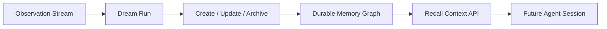

<div align="center">

# Dream-as-a-Service

### A long-term memory lifecycle service for agents

<p>
  <em>By day, your agents collect sparks.<br/>By night, this service turns them into constellations.</em>
</p>

<p>
  
  
  
  
  
</p>

</div>

---

## First Glance

Dream-as-a-Service is a full-stack reference implementation of a **memory lifecycle service** for AI systems.

It is not:

- a chat transcript archive
- a vector database with prettier language
- a passive note store

It is:

- an **observation intake layer**
- a **dream consolidation engine**
- a **durable memory graph**
- a **recall interface for future agents**

The governing idea is simple:

> raw signal should be easy to gather,  
> but hard-earned memory should be curated.

---

## Why It Exists

Most memory systems for agents fail in a familiar way.

They remember too much.  
They remember without taste.  
They retrieve stale fragments with the confidence of prophecy.

Dream-as-a-Service tries a stricter posture:

1. **Observations are cheap.**  
   Let agents collect fragments freely.

2. **Durable memory is expensive.**  
   Only keep what still matters after the current turn is over.

3. **Dreams are governance, not storage.**  
   A dream can create, update, merge, prune, or archive memory.

4. **Recall should feel curated.**  
   The future agent should inherit a constellation, not a junk drawer.

---

## What This Demo Ships

| Layer | What you get |
| --- | --- |
| Backend | FastAPI API service for observations, dream runs, durable memories, and retrieval |
| Frontend | A neuron-and-starlight interface for inspecting the dream graph |
| Seed Data | Rich fictional operational memory with users, projects, references, and pending signals |
| Tests | API tests that validate dream processing and retrieval behavior |
| Delivery | Dockerfiles for frontend/backend plus `docker compose` orchestration |

---

## System Mood

The UI is intentionally not a generic admin dashboard.

It is designed as a **nocturnal memory observatory**:

- poster-like hero composition
- deep ocean and amber atmosphere
- glowing neural constellation
- memory ribbons instead of card mosaics
- “incoming weather” for raw observations

The visual thesis is:

> memory should feel less like a filing cabinet  
> and more like a living night sky

---

## Core Model

This implementation centers on four entities:

| Entity | Meaning |
| --- | --- |
| `Observation` | Raw incoming signal from chat, tools, systems, incidents, or workflows |
| `Memory` | Durable context worth carrying into future sessions |
| `DreamRun` | A reflective consolidation pass over pending observations |
| `DreamMutation` | The record of what the dream changed and why |

### Durable Memory Types

The service currently uses four memory types:

- `user`
- `feedback`
- `project`
- `reference`

That choice is deliberate.  
The goal is to preserve **future-useful, non-obvious context**, not mirror code, tickets, or documentation line-for-line.

---

## Dream Lifecycle



### In this repository, a dream run:

1. reads all unprocessed observations
2. groups them into memory clusters
3. creates new memories or reinforces existing ones
4. refreshes freshness state
5. archives weak dormant memories when needed
6. records every mutation for inspection

You can think of the architecture as:

`observation stream -> dream consolidation -> durable memory graph -> recall`

---

## Interface Surfaces

### Backend

The backend exposes a compact but useful memory API.

<details>
<summary><strong>Primary endpoints</strong></summary>

- `GET /api/health`
- `GET /api/story`
- `GET /api/overview`
- `GET /api/observations`
- `POST /api/observations`
- `GET /api/memories`
- `GET /api/memories/{id}`
- `POST /api/retrieve-context`
- `GET /api/dream-runs`
- `GET /api/dream-runs/{id}`
- `POST /api/dream-runs`
- `GET /api/constellation`

</details>

### Frontend

The frontend shows the memory system as a living graph rather than a plain CRUD table.

- **Hero**: the project as a memory instrument
- **Neural Constellation**: observations, memories, and dream runs rendered as a glowing field
- **Latest Dream Rail**: the most recent mutation summary
- **Durable Memory Gallery**: strongest surviving memories
- **Incoming Weather**: pending observations waiting for the next night shift

---

## Seed World

This demo includes a fictional but believable operating world so the interface feels alive on first boot.

The seed data includes:

- users with collaboration preferences
- project-level delivery and compliance constraints
- team-level reference beacons
- fresh, unprocessed observations waiting for a dream

That means the service can demonstrate:

- memory reinforcement
- new memory creation
- recall scoring
- dream mutation history
- graph visualization

without any manual setup.

---

## Local Development

### Backend

```bash
cd backend
python3 -m venv .venv
source .venv/bin/activate
pip install -r requirements.txt
uvicorn app.main:app --reload
```

Backend runs at `http://localhost:8000`.

### Frontend

```bash
cd frontend
npm install
npm run dev
```

Frontend runs at `http://localhost:5173`.

To point the frontend at a custom backend:

```bash
VITE_API_BASE_URL=http://localhost:8000/api npm run dev
```

---

## Docker

Run the whole system with one command:

```bash
docker compose up --build
```

Then open:

- frontend: `http://localhost:3000`
- backend: `http://localhost:8000`

The frontend container proxies `/api` to the backend automatically.

---

## Tests

```bash
cd backend
pytest
```

The current test suite verifies:

- seed data appears on startup
- retrieval returns relevant ranked memories
- manual dream runs process pending signals
- the constellation payload contains dreams, observations, and memories
- new observations can be created through the API

---

## Project Structure

```text
dream-as-a-service
├── backend
│   ├── app
│   │   ├── main.py
│   │   ├── models.py
│   │   ├── schemas.py
│   │   └── services
│   ├── tests
│   └── Dockerfile
├── frontend
│   ├── src
│   │   ├── components
│   │   ├── lib
│   │   └── styles.css
│   └── Dockerfile
└── docker-compose.yml
```

---

## If You Wanted To Productize It

This repository is deliberately a strong first version, not the end state.

Natural next layers would be:

- multi-tenant auth
- policy-aware memory retention
- human review for dream mutations
- better retrieval ranking
- scheduling and background workers
- memory lineage and audit views
- workflow integrations
- richer scope and tenancy controls

---

## Final Question

A good memory system should not only ask:

### What can we store?

It should ask:

### What deserves to survive the night?
