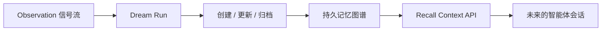
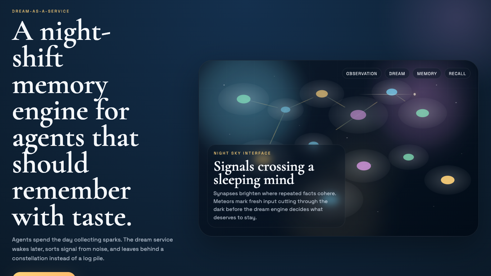

<div align="center">

# Dream-as-a-Service

### 面向智能体的长期记忆生命周期服务

<p>
  <em>白天，智能体收集火花。<br/>夜晚，这个系统把它们整理成星座。</em>
</p>

<p>
  
  
  
  
  
</p>

</div>

---

## 一眼看懂

Dream-as-a-Service 是一个完整的全栈参考实现，用来演示**智能体长期记忆服务**应该如何被设计成一个“生命周期系统”。

它不是：

- 聊天记录归档库
- 换了个说法的向量数据库
- 被动保存内容的笔记仓库

它是：

- **观察信号接入层**
- **dream 整理引擎**
- **持久记忆图谱**
- **未来智能体可调用的召回接口**

这个项目的核心判断很简单：

> 原始信号应该容易采集，  
> 但真正长期保留的记忆必须经过整理。

---

## 为什么要做它

很多智能体记忆系统最后都会走向同一种失败：

它们记得太多。  
它们记得没有分寸。  
它们把早已过期的碎片，当成启示一样召回出来。

Dream-as-a-Service 试图采取一种更克制的姿态：

1. **观察是廉价的。**  
   让智能体自由记录工作中遇到的信号。

2. **持久记忆是昂贵的。**  
   只有跨越当前回合之后仍然有价值的内容，才值得留下。

3. **Dream 是治理层，而不是存储层。**  
   一次 dream 可以创建、更新、合并、修剪，甚至归档记忆。

4. **召回应当像策展，而不是翻垃圾堆。**  
   未来的智能体继承的应该是一片星座，而不是一个抽屉。

---

## 这个 Demo 已经包含什么

| 层 | 内容 |
| --- | --- |
| 后端 | 基于 FastAPI 的 observations、dream runs、durable memories、retrieval API |
| 前端 | 神经元 / 星图风格的记忆可视化界面 |
| 默认数据 | 足够丰富的虚构运行世界、用户偏好、项目约束和待处理信号 |
| 测试 | 验证 dream 处理链路和召回行为的 API 测试 |
| 交付 | 前后端 Dockerfile + `docker compose` 编排 |

---

## 界面气质

这个前端故意没有做成常见的后台管理面板。

它被设计成一个**夜间记忆观测站**：

- 海报式首屏
- 深海与琥珀色的氛围
- 发光的神经元星座图
- 用“记忆丝带”代替普通卡片墙
- 用“天气带”呈现尚未被吸收的原始观察

它的视觉命题是：

> 记忆不应该看起来像文件柜，  
> 而应该像一片会呼吸的夜空。

---

## 核心模型

这个实现围绕四个实体展开：

| 实体 | 含义 |
| --- | --- |
| `Observation` | 来自聊天、工具、系统事件、事故、业务流程的原始信号 |
| `Memory` | 值得跨会话保留的持久上下文 |
| `DreamRun` | 一次反思式的整理过程 |
| `DreamMutation` | 一次 dream 对记忆所做变更的记录 |

### 持久记忆类型

当前使用四种长期记忆类型：

- `user`
- `feedback`
- `project`
- `reference`

这个选择是刻意的。  
系统想保存的是**未来仍然有用、且不那么显然的上下文**，而不是简单复刻代码、工单或文档。

---

## Dream 生命周期



### 在这个仓库里，一次 dream run 会做这些事：

1. 读取所有尚未处理的 observations
2. 按 scope、type、cluster key 把信号聚成记忆簇
3. 创建新记忆，或者强化已有记忆
4. 刷新 freshness 状态
5. 在必要时归档弱且沉睡的旧记忆
6. 记录每一次 mutation，方便后续查看

你可以把整套流程理解为：

`observation stream -> dream consolidation -> durable memory graph -> recall`

---

## 系统界面

### 后端

后端提供了一组紧凑但足够实用的记忆 API。

<details>
<summary><strong>主要接口</strong></summary>

- `GET /api/health`
- `GET /api/story`
- `GET /api/overview`
- `GET /api/observations`
- `POST /api/observations`
- `GET /api/memories`
- `GET /api/memories/{id}`
- `POST /api/retrieve-context`
- `GET /api/dream-runs`
- `GET /api/dream-runs/{id}`
- `POST /api/dream-runs`
- `GET /api/constellation`

</details>

### 前端

前端把记忆系统表现成一张活的图，而不是简单的 CRUD 表格。

<p align="center">
  
</p>

- **Hero 首屏**：把项目本身展示成一个记忆装置
- **Neural Constellation**：把 observations、memories、dream runs 画成一片发光场
- **Latest Dream Rail**：展示最近一次 dream 的变更摘要
- **Durable Memory Gallery**：展示当前最强的长期记忆
- **Incoming Weather**：展示等待被夜班吸收的原始信号

---

## 默认世界观与测试数据

这个 Demo 自带了一套虚构但可信的运行世界，让系统一启动就“有生命”。

种子数据包含：

- 有明确协作偏好的用户
- 项目级的约束与风险
- 团队级的外部参考入口
- 一批等待下一次 dream 处理的全新 observations

因此它开箱就能演示：

- 记忆强化
- 新记忆创建
- 召回排序
- dream mutation 历史
- 图谱可视化

而不需要你手工先灌数据。

---

## 本地开发

### 后端

```bash
cd backend
python3 -m venv .venv
source .venv/bin/activate
pip install -r requirements.txt
uvicorn app.main:app --reload
```

后端默认运行在 `http://localhost:8000`。

### 前端

```bash
cd frontend
npm install
npm run dev
```

前端默认运行在 `http://localhost:5173`。

如果你想把前端指向自定义后端：

```bash
VITE_API_BASE_URL=http://localhost:8000/api npm run dev
```

---

## Docker

一条命令启动整个系统：

```bash
docker compose up --build
```

启动后访问：

- 前端：`http://localhost:3001`
- 后端：`http://localhost:8000`

前端容器会自动把 `/api` 代理到后端。

---

## 测试

```bash
cd backend
pytest
```

当前测试覆盖：

- 启动时是否自动加载 seed data
- 检索接口是否返回相关且排序合理的记忆
- 手动触发 dream run 是否会处理 pending observations
- constellation payload 是否同时包含 dreams、observations、memories
- 是否可以通过 API 创建新 observation

---

## 项目结构

```text
dream-as-a-service
├── backend
│   ├── app
│   │   ├── main.py
│   │   ├── models.py
│   │   ├── schemas.py
│   │   └── services
│   ├── tests
│   └── Dockerfile
├── frontend
│   ├── src
│   │   ├── components
│   │   ├── lib
│   │   └── styles.css
│   └── Dockerfile
└── docker-compose.yml
```

---

## 如果你想把它继续产品化

这个仓库刻意做成了一版扎实的起点，而不是最终形态。

自然的下一步会包括：

- 多租户鉴权
- policy-aware 的记忆保留策略
- dream mutation 的人工审核流
- 更强的召回排序
- 定时任务和后台 worker
- 记忆血缘与审计视图
- 更多 workflow 集成
- 更丰富的 scope / tenancy 管理

---

## 最后的问题

一个好的记忆系统不应该只问：

### 我们能存下什么？

它更应该问：

### 什么值得穿过黑夜，被真正留下？
